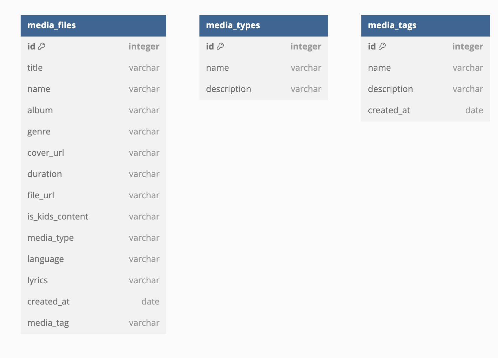
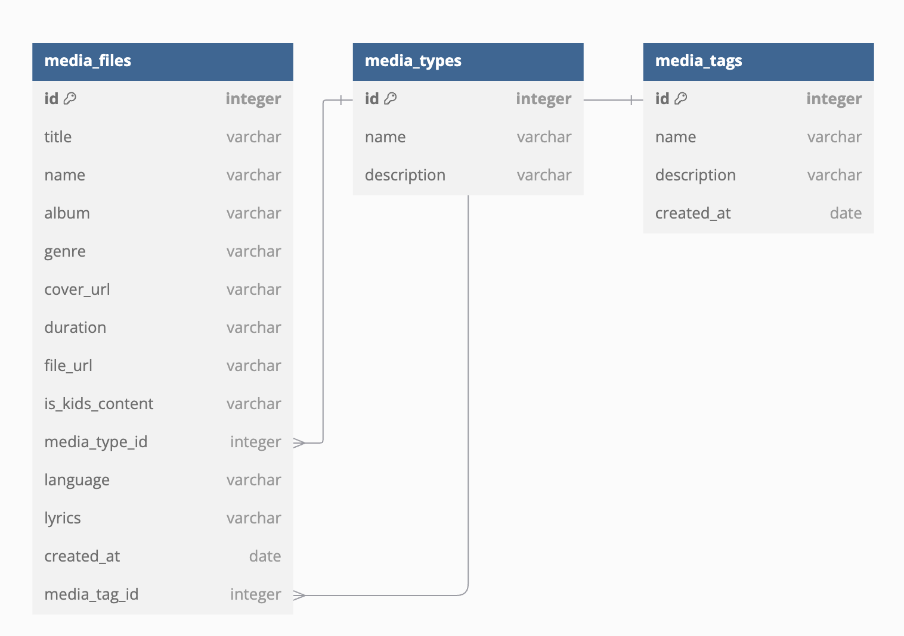

# Current DB Design
```
table media_files {
  id integer [primary key]
  title varchar
  name varchar
  album varchar
  genre varchar
  cover_url varchar
  duration varchar
  file_url varchar
  is_kids_content varchar
  content_type varchar
  language varchar
  lyrics varchar
  created_at date
  media_tag varchar
}

table content_types {
  id integer [primary key]
  name varchar
  description varchar
}

table media_tags {
  id integer [primary key]
  name varchar
  description varchar
  created_at date
}
```





# To be designed
The idea is to add reference keys and use ids of content_type and the media_tags instead of thier name, this may give flexibility of modying the names if necessary and maintains the relationships. 
```
table media_files {
  id integer [primary key]
  title varchar
  name varchar
  album varchar
  genre varchar
  cover_url varchar
  duration varchar
  file_url varchar
  is_kids_content varchar
  content_type_id integer
  language varchar
  lyrics varchar
  created_at date
  media_tag_id integer
}

table content_types {
  id integer [primary key]
  name varchar
  description varchar
}

table media_tags {
  id integer [primary key]
  name varchar
  description varchar
  created_at date
}

Ref: media_files.media_tag_id > media_tags.id
Ref: media_files.content_type_id > content_types.id
```
## Diagram



